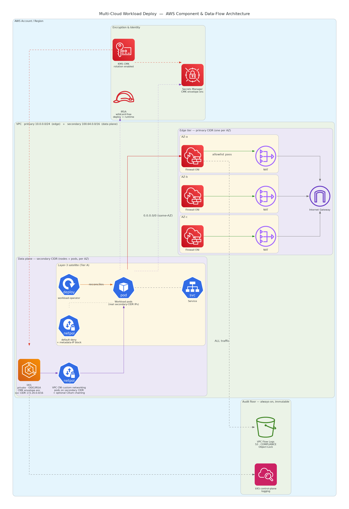

# AWS Architecture — Building Blocks & `aws-full` Greenfield

**Owner:** Infrastructure / Platform
**Status:** Draft for review
**Version:** 1.0

> Companion documents: [`../architecture.md`](../architecture.md) (cross-cloud architecture) ·
> [`../spec.md`](../spec.md) (requirements & scope) · [`../design.md`](../design.md) (engineering
> design). This page details the **AWS** realization of the Layer-1/Layer-2 building blocks and
> the `aws-full` greenfield composition.

---

## 1. Component & Data-Flow Overview



The diagram is a **component & data-flow** view: it shows the AWS building blocks, the
cloud-agnostic satellite running on them, and how a workload's runtime traffic and data move
between them — not a deployment sequence. The load-bearing flows are:

- **Default-deny egress (red → green):** workload pods send all `0.0.0.0/0` traffic to the
  **same-AZ AWS Network Firewall endpoint**, which passes only the FQDN/CIDR allowlist onward to
  the NAT gateway and Internet Gateway. Everything else is dropped at the perimeter.
- **Envelope encryption (KMS):** a single customer-managed key (CMK) with rotation encrypts both
  EKS secrets at rest and the Secrets Manager material.
- **Scoped identity (IRSA):** workload pods assume an IRSA role whose policy is scoped to the
  resolved CMK and the workload's secret path prefix — no static keys, no wildcards.
- **Always-on audit floor:** VPC Flow Logs capture **all** traffic to a customer-owned,
  retention-locked S3 bucket; EKS control-plane logging streams to CloudWatch. Both are
  independent of the cluster CNI and survive cluster compromise.

---

## 2. Network Topology — Primary / Secondary CIDR Split

The VPC carries **two CIDR blocks with two distinct jobs**, so the routable address space the
edge needs stays small and stable while the data plane scales independently.

| CIDR | Role | Tiers | Sizing intent |
|---|---|---|---|
| **Primary** (e.g. `10.0.0.0/24`) | Edge / control path | public (NAT, load balancers), firewall-endpoint | Small and stable — never grows with the workload |
| **Secondary** (e.g. `100.64.0.0/16`) | Data plane | node subnets, pod subnets | Large CGNAT-range space so node/pod IP churn never exhausts the routable primary CIDR |

**Why the split.** Pods draw real VPC IPs from the dedicated pod subnets in the secondary CIDR,
so a pod-IP spike can never starve node launches in the node subnets, and pod traffic remains a
distinct CIDR for flow-log, firewall, and NetworkPolicy reasoning. The non-routable
`100.64.0.0/10` space lets the data plane grow without consuming scarce routable RFC-1918
address space or renumbering the edge.

**Service IPs are virtual.** Kubernetes `ClusterIP` Service addresses are never real VPC IPs;
they are assigned from the cluster's `service_ipv4_cidr` (e.g. `172.20.0.0/16`), a range that
must **not** overlap either VPC CIDR.

### High availability

Every edge element is provisioned **per availability zone**: one NAT gateway, one Network
Firewall endpoint, and one data-plane route table per AZ. The loss of a single AZ never strands
another AZ's egress. At least two AZs are required.

### Egress path (the load-bearing security control)

```
node / pod (secondary CIDR)
   │  0.0.0.0/0  (per-AZ route → same-AZ firewall endpoint)
   ▼
AWS Network Firewall endpoint (primary CIDR, one per AZ)
   │  STRICT_ORDER stateful policy, default action aws:drop_established
   │  passes only allowlisted FQDNs (Suricata TLS-SNI / HTTP-Host rules) + CIDRs
   ▼
NAT gateway (primary CIDR, per AZ) ──▶ Internet Gateway ──▶ internet
```

The firewall is genuinely *in path*: each node/pod subnet's default route points at its own AZ's
firewall endpoint, and only the firewall-endpoint subnets route onward to the NAT. The FQDN
allowlist is expressed as STRICT_ORDER-compatible Suricata `pass` rules (TLS SNI and HTTP Host
matches), preserving a strict default-deny perimeter.

### Audit floor

VPC Flow Logs record **all** traffic to a customer-owned S3 bucket with **COMPLIANCE-mode Object
Lock** — objects cannot be deleted or overwritten by anyone (including the account root) until
their retention period elapses. This is the always-on, immutable audit floor; it is CNI-
independent and survives cluster compromise.

---

## 3. Pod Networking — VPC CNI Custom Networking

The cluster uses the **AWS VPC CNI with custom networking** — the AWS-supported way to place pods
on the secondary CIDR:

- **Pods get real secondary-CIDR VPC IPs.** The `vpc-cni` addon is configured (via its
  `configuration_values`) with `AWS_VPC_K8S_CNI_CUSTOM_NETWORK_CFG=true` and a per-AZ `ENIConfig`
  pointing at the **pod subnets**. The VPC CNI then allocates pod secondary ENIs from those subnets
  while the node primary ENI stays in the node subnet — pod traffic is first-class VPC traffic
  (visible in VPC Flow Logs, security-group-addressable), entirely within the secondary CIDR.
  `ENABLE_PREFIX_DELEGATION` recovers the per-node pod density the primary ENI would otherwise lose.
- **No bootstrap gap.** The VPC CNI is the default EKS CNI and the addon is installed **before** the
  managed node group, so nodes reach `Ready` immediately. (An alternate-CNI approach that removed
  the VPC CNI would leave nodes `NotReady` until a replacement CNI installed — the classic
  EKS chicken-and-egg; custom networking avoids it.)
- **Identity-aware policy is an optional overlay.** Cilium can be installed in **chaining mode**
  (`cni.chainingMode=aws-cni`) *on top of* the VPC CNI for DNS-aware egress (`toFQDNs`), Hubble flow
  observability, and richer NetworkPolicy. It does not own IPAM, so it never gates node readiness.
  It is **off by default** — the portable default-deny `NetworkPolicy` + metadata-IP block (agnostic
  security layer) and the perimeter firewall already provide the floor.

The perimeter Network Firewall remains the CNI-independent backstop: it enforces at the VPC edge,
and VPC Flow Logs record regardless of any in-cluster layer.

---

## 4. Building Blocks (Layer 1 / Layer 2)

Each module is a focused, provision-or-BYO building block exposing a stable output interface. The
single create-vs-lookup decision lives only in the matching `*-resolver` module, so everything
downstream receives identical inputs whether a resource was created or looked up.

| Module | Provides | Key outputs |
|---|---|---|
| `network` | VPC (primary + secondary CIDR), per-AZ subnets/NAT, Network Firewall (FQDN/CIDR allowlist, default-deny), VPC Flow Logs to retention-locked S3 | `vpc_id`, `private_subnet_ids`, `pod_subnet_ids`, `firewall_subnet_ids`, `egress_path_ref`, `flow_log_bucket_arn` |
| `network-resolver` | Uniform network interface, created or looked up | `vpc_id`, `subnet_ids`, `egress_path_ref` |
| `kms` | CMK with rotation, or a resolved BYO key | `key_arn`, `key_id`, `alias_name` |
| `secrets` | Secrets Manager secrets (CMK envelope-encrypted) + Secrets Store CSI `SecretProviderClass` | `secret_arns`, `secrets_ref`, `secret_provider_class_name` |
| `iam` | IRSA role + OIDC trust; action-derived, resource-scoped, wildcard-free policies (deploy-time + runtime) as reviewable JSON artifacts | `role_arn`, `workload_identity_ref`, `deploy_policy_json`, `runtime_policy_json`, `trust_policy_json` |
| `cluster` | Hardened private EKS: OIDC issuer (IRSA), CMK secrets envelope encryption, control-plane logging | `cluster_name`, `endpoint`, `ca`, `oidc_provider_arn`, `oidc_issuer_url` |
| `cluster-resolver` | Uniform cluster interface, created or looked up | `endpoint`, `ca`, `auth` |
| `preflight` | Terraform-native data-source pre-checks co-located with the AWS modules | `checks_passed`, `notes` |

### Least-privilege identity

The `iam` module renders **two** policy documents as reviewable, versioned artifacts:

- **Runtime workload identity** — `kms:Decrypt`/`GenerateDataKey`/`DescribeKey` scoped to the
  resolved CMK ARN; `secretsmanager:GetSecretValue`/`DescribeSecret` scoped to the workload's
  secret **path prefix**; image-registry pull. No account-wide wildcards.
- **Deploy-time identity** — the create/manage permission set for the path being run, scoped to
  the target resources, emitted so a customer can inspect it before granting.

Scoping the runtime policy at the secrets **path prefix** (rather than per-secret ARN) keeps the
`iam` and `secrets` modules decoupled — they are siblings with no dependency cycle.

---

## 5. `aws-full` Greenfield Composition

`aws-full` provisions AWS infrastructure and then composes the **same** cloud-agnostic Layer-3
modules used by the BYOC fast path, yielding a secure, observable, lifecycle-managed satellite on
a freshly provisioned EKS cluster:

```
network → kms → iam → secrets → cluster (incl. vpc-cni custom networking) →
        (network-resolver, cluster-resolver) → preflight (full mode, AWS provider) →
        Layer-3 modules (operator, security, observability, workload) [+ optional Cilium chaining]
```

### Two-phase apply

`aws-full` is a documented **two-phase apply**, not a single `terraform apply`. The
`kubernetes`/`helm`/`kubectl` providers are configured from `cluster-resolver` outputs
(endpoint, CA, auth) that do not exist until the EKS cluster is created, and Terraform forbids
provider configuration that depends on not-yet-created resources.

1. **Phase 1 — cloud infrastructure incl. the cluster.** Provision `network`, `kms`, `iam`,
   `secrets` (secret creation), `cluster`, and the resolvers.
2. **Phase 2 — Layer 3.** With the cluster's endpoint/CA/auth known, configure the Kubernetes
   providers and apply the preflight gate, the Secrets Store CSI `SecretProviderClass`, the agnostic
   Layer-3 modules, and (optionally) Cilium in chaining mode. The VPC CNI custom networking is part
   of the cluster (Phase 1), so pods are already on the secondary CIDR before Phase 2.

> The BYOC fast path (`_agnostic-deploy`), which targets an existing cluster, **is** a genuine
> single `terraform apply` — only greenfield provisioning needs two phases.

Cluster authentication uses the EKS exec-plugin (`aws eks get-token`), so the provider fetches a
fresh token at apply time rather than persisting one in state.

---

## 6. Preflight on AWS

The cloud-agnostic preflight checker gains a real AWS provider for the cloud-facing stages,
selected with `--cloud=aws`. In greenfield it runs in `--mode=full`, where stages satisfied by
provisioning are informational rather than blocking:

| Stage | AWS check | Outcome | Applies when |
|---|---|---|---|
| 0 — Identity | Deploy-identity permissions via IAM `SimulatePrincipalPolicy`, scoped to the concerns being provisioned | Missing required permission ⇒ blocking (red); excess detection best-effort | something is provisioned |
| 1 — KMS | CMK exists, enabled, rotating (`DescribeKey` + rotation status) | Usable key ⇒ green | a CMK is configured |
| 2 — Secrets | Secrets Manager secret reachable and CMK-encrypted (`DescribeSecret`) | Encrypted ⇒ green | secrets are configured |
| 3 — Egress | VPC/NAT present, firewall in-path and metadata endpoint blockable (route-table inspection) | In-path firewall + metadata block ⇒ green; FQDN reachability proven at apply time | a VPC is configured |

**The cloud stages self-gate on applicability.** Each is independent of the others, matching the
independent BYO/provision toggles: a stage whose concern is **BYO** (no CMK, no secrets, no VPC, or
nothing provisioned at all) reports **amber — not applicable**, never a false red. Stage 0
simulates only the create-actions for the concerns actually being provisioned, so a BYO-everything
footprint requires no provisioning permissions. When the customer brings the cluster, the
load-bearing gate is the cloud-agnostic Kubernetes stages (4–5), not these cloud stages — see
[`../operations/common/preflight.md`](../operations/common/preflight.md) and the BYO examples in
[`../operations/aws/deploy.md`](../operations/aws/deploy.md).

The `preflight` AWS module additionally co-locates Terraform-native data-source pre-checks with
the building blocks. The split is deliberate: the Go provider performs the dynamic stage checks
(API calls), while the Terraform checks assert static, plan-time-knowable preconditions.

---

## 7. Defense in Depth — Summary

| Layer | Control |
|---|---|
| Perimeter | Network Firewall FQDN allowlist + default-deny egress (CNI-independent) |
| Audit | VPC Flow Logs → retention-locked (COMPLIANCE Object-Lock) S3, always-on |
| Identity | IRSA; wildcard-free deploy + runtime IAM policies as reviewable artifacts |
| Encryption | CMK (rotation) → EKS secrets envelope encryption + Secrets Manager envelope encryption |
| In-cluster | Default-deny `NetworkPolicy` + metadata-IP block + PodSecurity Admission |
| Identity-aware (optional) | Cilium chaining mode on top of the VPC CNI — `toFQDNs` / Hubble / NetworkPolicy |
