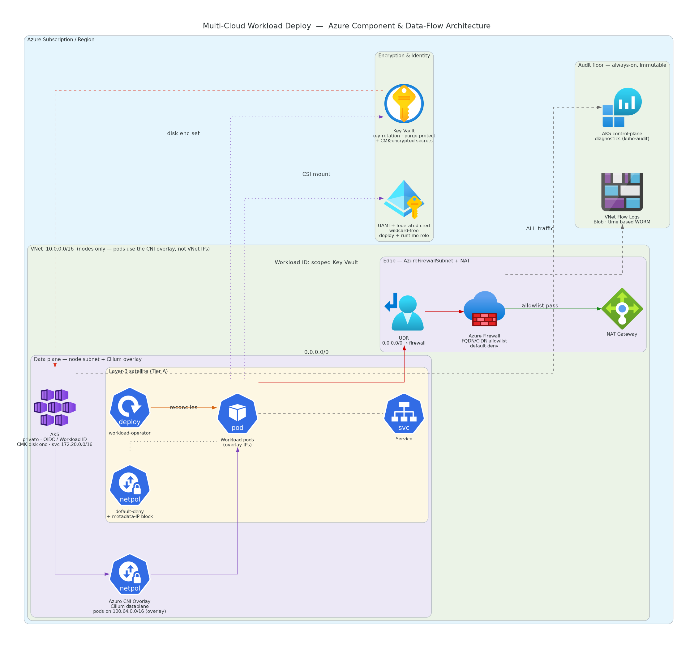

# Azure Architecture — Building Blocks & `azure-full` Greenfield

**Owner:** Infrastructure / Platform
**Status:** Draft for review
**Version:** 1.0

> Companion documents: [`../architecture.md`](../architecture.md) (cross-cloud architecture) ·
> [`../spec.md`](../spec.md) (requirements & scope) · [`../design.md`](../design.md) (engineering
> design). This page details the **Azure** realization of the Layer-1/Layer-2 building blocks and
> the `azure-full` greenfield composition.

---

## 1. Component & Data-Flow Overview



The diagram is a **component & data-flow** view: it shows the Azure building blocks, the
cloud-agnostic satellite running on them, and how a workload's runtime traffic and data move
between them — not a deployment sequence. The load-bearing flows are:

- **Default-deny egress (red → green):** a route table (UDR) forces all `0.0.0.0/0` node-subnet
  traffic to the **Azure Firewall**, which passes only the FQDN/CIDR allowlist onward to the NAT
  gateway. Everything else is dropped at the perimeter, independent of the cluster CNI.
- **Envelope encryption (Key Vault):** a single customer-managed key with rotation backs the AKS
  disk encryption set and encrypts the Key Vault secret material at rest.
- **Scoped identity (Workload Identity):** workload pods run as a user-assigned managed identity
  (UAMI) bound to the Kubernetes ServiceAccount through a federated credential on the AKS OIDC
  issuer. Its custom role is scoped to the resolved Key Vault — no client secrets, no wildcards,
  no built-in Owner/Contributor.
- **Always-on audit floor:** VNet flow logs capture **all** traffic to a customer-owned,
  time-based-immutable (WORM) Storage container; AKS control-plane diagnostic settings stream
  kube-audit/apiserver logs to Log Analytics. Both are independent of the cluster CNI and survive
  cluster compromise.

---

## 2. Network Topology — Single VNet, Overlay Pods

Unlike AWS (which splits the VPC into a primary edge CIDR and a secondary data-plane CIDR because
EKS places pods on real VPC IPs), Azure puts pods on a **CNI overlay** that does not consume VNet
address space. The VNet therefore carries **one CIDR**, sized only for nodes.

| Range | Role | Lives in VNet? | Sizing intent |
|---|---|---|---|
| **VNet / node subnet** (e.g. `10.0.0.0/16`, node subnet `/20`) | Nodes + edge (firewall subnet) | Yes | Sizes the **node** count only; can be as small as a `/24` |
| **Pod CIDR** (`100.64.0.0/16`) | Pod IPs (Azure CNI Overlay) | **No** — overlay | ~65k pod IPs, independent of the VNet |
| **Service CIDR** (`172.20.0.0/16`) | Virtual `ClusterIP`s | No — virtual | Must not overlap the VNet or pod CIDR |

**Cross-cloud consistency.** The pod CIDR defaults to **`100.64.0.0/16`** — the same CGNAT block
AWS Phase D uses for its data plane — and the service CIDR to **`172.20.0.0/16`**, matching the
EKS service range. On AWS those pod IPs are real VPC IPs; on Azure they are overlay IPs. The
address plan is identical across clouds, so operators reason about the same pod/service ranges
everywhere.

**Small VNet, many pods.** Because pods draw from the overlay, a `/24` VNet (~250 nodes) can still
run thousands of pods: `nodes × max_pods` (default `250`) bounds the total, capped only by the
overlay CIDR. Grow the VNet only when you need more than ~250 nodes — never for pod density.

### High availability

AKS spreads the system node pool across the region's availability zones; the NAT gateway and Azure
Firewall are zone-resilient SKUs. The UDR forcing egress through the firewall applies to the whole
node subnet.

### Egress path (the load-bearing security control)

The node subnet has **no public IPs**. A route table sends `0.0.0.0/0` to the Azure Firewall
private IP (`next_hop_type = VirtualAppliance`); the cluster's `outbound_type` is
`userDefinedRouting`. The firewall's application rule collection allows only the configured FQDNs
(control-plane, `ghcr.io`, `*.azurecr.io`, `login.microsoftonline.com`); an optional network rule
collection allows specific CIDRs. Everything else is denied at the perimeter — this holds
regardless of the in-cluster CNI.

### Audit floor

VNet flow logs stream **all** node-subnet traffic to a customer-owned Storage account whose
container carries a **time-based immutability policy** (WORM). The account is private-access-only,
TLS1.2, GRS-replicated. The flow log is CNI-independent and survives cluster compromise — the
always-on audit record of record.

---

## 3. Pod Networking — Azure CNI Overlay + Cilium Dataplane

The AKS cluster is created with **Azure CNI Overlay and the Cilium dataplane**, selected at
cluster creation:

```
network_plugin      = "azure"
network_plugin_mode = "overlay"
network_data_plane  = "cilium"
network_policy      = "cilium"
```

This is the Azure analogue of GKE Dataplane V2: Cilium runs as the in-cluster eBPF dataplane
**without any separate `helm_release`**. Pods get overlay IPs from `pod_cidr`; the node primary
NIC stays in the VNet node subnet. This is the **divergence from AWS Phase D**, where Cilium is a
Helm release chained on top of the VPC CNI (EKS has no managed Cilium dataplane). On Azure there
is no `install_cilium` toggle and no Cilium chart — the dataplane selection is the entire Cilium
story.

The portable Layer-3 `k8s-security` NetworkPolicy floor (default-deny + metadata-IP block + the
intra-namespace allow for the workload port) is enforced regardless of CNI; Cilium provides the
identity-aware / `toFQDNs` / Hubble enhancement layer, and the Azure Firewall is the perimeter
FQDN backstop.

---

## 4. Building Blocks (Layer 1 / Layer 2)

| Module | Provisions (or resolves in BYO) |
|---|---|
| `network` | VNet + node/firewall subnets, NAT gateway, Azure Firewall (FQDN/CIDR allowlist), UDR default-deny, NSG, immutable VNet flow logs |
| `network-resolver` | Uniform `{vpc_id, subnet_ids, egress_path_ref}` (create-vs-lookup isolation point) |
| `kms` | Key Vault (purge protection + soft delete, RBAC auth, default-deny network ACL) + Key with rotation policy; or resolves a BYO vault/key |
| `iam` | UAMI + federated identity credential (SA→UAMI) + wildcard-free custom runtime role scoped to the vault + AcrPull (registry-scoped); reviewable runtime + deploy-time JSON artifacts |
| `secrets` | Key Vault secrets (CMK-encrypted) + Secrets Store CSI `SecretProviderClass` (azure provider) |
| `cluster` | Hardened private AKS: CNI Overlay + Cilium dataplane, Workload Identity + OIDC, disk encryption set, managed RBAC, Azure Policy, OMS + control-plane diagnostics |
| `cluster-resolver` | Uniform `{endpoint, ca, auth}` where `auth` is a tagged object (`client_cert` or `exec`/kubelogin) |
| `preflight` | Co-located Terraform data-source pre-checks (region/vault/key) |

### Least-privilege identity

The workload runtime role is a **custom `azurerm_role_definition`** enumerating only the Key Vault
crypto + secret DataActions the workload needs — the reviewable equivalent of the built-in "Key
Vault Crypto User" + "Key Vault Secrets User" roles, with **no `*` wildcards and no Owner /
Contributor / User Access Administrator**. It is *assignable* only at the resource-group scope and
*assigned* (via role assignment) scoped to the **resolved Key Vault only**. Image pull uses the
built-in **AcrPull** role scoped to a single registry. The role assignment is at the **vault
level**, so the `iam` module never needs `secrets.secret_ids` — breaking the iam↔secrets module
cycle (the dependency is one-directional: `kms → iam`, `kms → secrets`, `iam → secrets`).

Both the runtime role and the **deploy-time** identity policy are rendered as reviewable JSON
artifacts (`role-definition.json`, `deploy-policy.json`, `federated-credential.json`), written to
the root's `artifacts/iam/` directory. A golden `terraform test` asserts both are wildcard-free
and resource-pinned.

---

## 5. `azure-full` Greenfield Composition

```
phase1-infra:  resource group → log analytics → network → kms → cluster → iam → kubeconfig
phase2-deploy: secrets → preflight (full mode, azure provider) →
               Layer-3 (operator, security, observability, workload)   [NO Cilium helm_release]
```

The shipped greenfield composition root lives under `roots/azure-full`. It can be run directly or
copied into a customer's IaC repo to wire their backend/state.

### Two-phase apply

Greenfield `azure-full` is two Terraform applies:

- `phase1-infra` creates the VNet, Key Vault, AKS, UAMI, and an exec-auth kubeconfig.
- `phase2-deploy` reads phase-1 state, creates Key Vault secret material, runs preflight against
  the live AKS API server, and installs Layer 3.

A private AKS API server is reachable only from inside the VNet, so apply from a VNet-connected
context — or, for testing, flip the endpoint to public with an IP allowlist. See
[`../operations/azure/deploy.md`](../operations/azure/deploy.md).

### Cluster auth (hardened default)

The cluster defaults to `local_account_disabled = true` (Entra-only), which requires Entra
integration (enabled automatically) and makes the kube_config cert/key empty. The resolver emits an
**exec** (`kubelogin`) auth object and the providers wire a `dynamic "exec"` block; `kubelogin` must
be on `PATH`. The cert/key form is the opt-in path (local accounts enabled). The uniform
`{endpoint, ca, auth}` shape is preserved; `auth.mode` selects the realization. Azure RBAC for
Kubernetes authorizes the deploying identity (grant *AKS RBAC Cluster Admin* or set
`admin_group_object_ids`).

---

## 6. Preflight on Azure

The Azure preflight contract has two halves:

1. **Go `cloud.PreflightProvider`** (`operator/internal/cloud/azure`) — the real staged checks:
   Stage 0 identity (the workload UAMI holds a non-privileged role at the resolved vault), Stage 1
   KMS (the key is enabled with a rotation policy), Stage 2 secrets (each secret resolves in the
   vault), Stage 3 egress (the VNet has a UDR forcing egress through the firewall). Selected via
   `--cloud=azure`; the Layer-3 `modules/preflight` invokes the binary and gates `apply` on the
   verdict.
2. **`modules/azure/preflight`** — co-located Terraform data-source pre-checks (region match, vault
   purge protection, key presence) that fail the plan fast inside the graph.

In `azure-full/phase2-deploy` the binary runs `--mode=full --cloud=azure`: stages the phase-1 path
satisfies by provisioning are downgraded red→amber (informational), not blocking. **Stage 0
scope:** the Go check validates the **runtime UAMI** binding, not the deploy-time identity; deploy-time
missing/excess detection is best-effort and deferred — the deploy-time policy is rendered as a
reviewable artifact so it is inspectable.

---

## 7. Defense in Depth — Summary

| Layer | Control |
|---|---|
| Perimeter | Azure Firewall FQDN/CIDR allowlist + UDR `0.0.0.0/0 → firewall` (default-deny egress) |
| Network identity | Private API endpoint (no public IP by default); NAT-only outbound |
| In-cluster | Cilium dataplane + portable NetworkPolicy floor (default-deny + metadata-IP block) |
| Pod Security | PSA `restricted` by default on the workload namespace |
| Identity | Workload Identity (federated cred, no static secrets); wildcard-free vault-scoped custom role |
| Encryption | Key Vault CMK with rotation → disk encryption set + CMK-encrypted secrets |
| Audit | Immutable (WORM) VNet flow logs + AKS control-plane diagnostics to Log Analytics |
