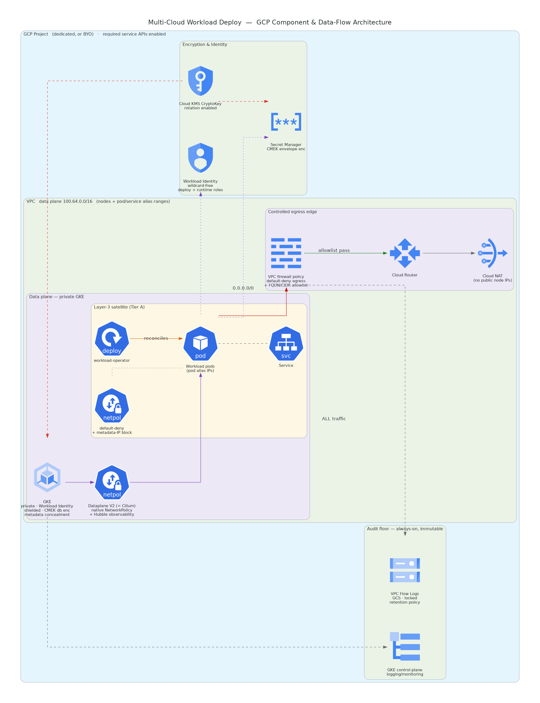

# GCP Architecture — Building Blocks & `gcp-full` Greenfield

**Owner:** Infrastructure / Platform
**Status:** Draft for review
**Version:** 1.0

> Companion documents: [`../architecture.md`](../architecture.md) (cross-cloud architecture) ·
> [`../spec.md`](../spec.md) (requirements & scope) · [`../design.md`](../design.md) (engineering
> design). This page details the **GCP** realization of the Layer-1/Layer-2 building blocks and
> the `gcp-full` greenfield composition.

---

## 1. Component & Data-Flow Overview

The diagram is a **component & data-flow** view: it shows the GCP building blocks, the
cloud-agnostic satellite running on them, and how a workload's runtime traffic and data move
between them — not a deployment sequence. The GCP realization runs the cloud-agnostic satellite on
a hardened private GKE cluster. The load-bearing flows are:

- **Default-deny egress:** workload pods have no public IPs; all egress leaves through a
  **Cloud NAT** on a Cloud Router, and a **VPC network firewall policy** drops everything except
  an explicit allowlist (the control-plane endpoint, intra-VPC ranges, Google APIs via the
  restricted VIP, DNS via the metadata server, and the configured FQDNs/CIDRs).
- **Envelope encryption (Cloud KMS):** a single customer-managed CryptoKey with rotation encrypts
  both GKE database/application-layer secrets at rest and the Secret Manager material (CMEK).
- **Scoped identity (Workload Identity):** workload pods run as a Kubernetes ServiceAccount bound
  to a Google service account via `roles/iam.workloadIdentityUser`; the GSA holds a custom role
  scoped to the resolved CryptoKey and the workload's secret-name prefix — no service-account
  keys, no primitive roles, no wildcards.
- **Always-on audit floor:** subnet VPC Flow Logs route through a Logging sink to a customer-owned,
  retention-locked Cloud Storage bucket; GKE control-plane logging/monitoring stream to Cloud
  Logging/Monitoring. Both are independent of the cluster CNI and survive cluster compromise.

---

## 2. Project Container

On GCP the **project** is the fundamental container: billing link, IAM boundary, and the scope
service APIs are enabled on. The deployment can either create a **dedicated project** (isolating
the workload's blast radius and quota) or resolve an **existing customer project** (BYOC). In both
cases the required service APIs (Compute, GKE, Cloud KMS, Secret Manager, IAM + credentials,
Logging, Monitoring, Artifact Registry, Resource Manager, Service Usage) are ensured enabled. A
created project disables the default permissive network.

---

## 3. Network Topology — Data-Plane CIDR Plan

The VPC uses a single subnet with **two secondary alias-IP ranges** for the GKE data plane:

| Range | Role | Sizing intent |
|---|---|---|
| **Primary subnet** (`100.64.0.0/18`) | Node IPs | No public IPs on nodes |
| **Pods** secondary range (`100.64.128.0/17`) | Pod alias IPs | The largest data-plane block so pod IP churn never exhausts routable space |
| **Services** secondary range (`100.64.64.0/19`) | Service alias IPs | Small block |

Nodes, pods, and services all draw from the CGNAT block `100.64.0.0/16`, keeping the data plane
off scarce routable RFC-1918 space. The GKE **private control-plane endpoint** uses a separate
`/28` (`172.16.0.0/28` by default) that must not overlap the data-plane ranges.

### Egress path (the load-bearing security control)

A VPC network firewall policy enforces **default-deny egress** (priority 65000) with explicit
higher-priority allow rules that a private cluster cannot function without:

| Priority | Allow | Why |
|---|---|---|
| 890 | Control-plane `master_ipv4_cidr_block` (tcp 443, 10250) | Node registration / kubelet |
| 895 | Intra-VPC ranges (all protocols) | Pod-to-pod / pod-to-node / pod-to-service |
| 900 | Restricted Google APIs VIP `199.36.153.4/30` (tcp 443) | Artifact Registry, KMS, Secret Manager, Workload Identity via Private Google Access |
| 910 | DNS via the metadata server `169.254.169.254` (udp/tcp 53) | Name resolution on-Google |
| 1000 | Configured FQDNs (tcp 443) | Control-plane FQDN, ghcr.io, etc. |
| 1100 | Configured CIDRs | Any additional allowed ranges |

Omitting the 890/895/900/910 allows under default-deny silently bricks the cluster (nodes cannot
register or pull). FQDN-match rules require Cloud NGFW; where unavailable, the CIDR allows plus the
in-cluster Cilium `toFQDNs` layer provide coverage.

### Audit floor

Subnet VPC Flow Logs (5-second interval, all metadata) route through a Logging sink into a
customer-owned Cloud Storage bucket with a **locked retention policy** and object versioning. The
bucket uses Google-managed encryption (not the workload CMK) so the audit trail remains readable
even if the workload key is destroyed.

---

## 4. Pod Networking — Dataplane V2 (Cilium)

GKE **Dataplane V2** (`datapath_provider = "ADVANCED_DATAPATH"`) is Cilium, so Cilium and
Kubernetes `NetworkPolicy` are native to the cluster — no separate CNI install. Dataplane V2
observability (advanced-datapath metrics + Hubble relay) provides flow/identity/L7 visibility. The
portable in-cluster `NetworkPolicy` floor (default-deny + scoped allow) and metadata-IP block are
enforced by the cloud-agnostic security layer regardless of CNI.

---

## 5. Building Blocks (Layer 1 / Layer 2)

| Module | Responsibility |
|---|---|
| `project` | Create-or-BYO project + required service-API enablement |
| `network` | VPC + subnet (secondary ranges), Cloud Router + NAT, firewall egress allowlist, retention-locked flow logs |
| `network-resolver` | Uniform `{vpc_id, subnet_ids, egress_path_ref}` (create-vs-lookup isolation point) |
| `kms` | Cloud KMS KeyRing + CryptoKey create-or-BYO with rotation |
| `secrets` | CMEK-encrypted Secret Manager + Secrets Store CSI `SecretProviderClass` |
| `iam` | GSA + Workload Identity binding + wildcard-free runtime & deploy-time custom roles; reviewable JSON artifacts |
| `cluster` | Hardened private GKE — Dataplane V2, Workload Identity, shielded nodes, metadata concealment, CMEK database encryption, release channel, control-plane logging/monitoring |
| `cluster-resolver` | Uniform `{endpoint, ca, auth}` (GKE token auth) |
| `preflight` | Co-located data-source pre-checks (project/network/KMS resolve) |

### Least-privilege identity

The runtime custom role enumerates only `cloudkms.cryptoKeyVersions.useToDecrypt/useToEncrypt`,
`secretmanager.versions.access`, and `artifactregistry.repositories.downloadArtifacts`. It is
attached at the **resource level** — on the resolved CryptoKey, on each Artifact Registry repo,
and (for Secret Manager) via an IAM condition scoping access to secrets matching the workload's
name prefix. No primitive roles, no wildcards, no project-wide grant. The deploy-time create/manage
role is rendered as a separate reviewable artifact and asserted consistent with the preflight
permission probe.

---

## 6. `gcp-full` Greenfield Composition

`gcp-full` provisions the project, VPC/firewall/flow-logs, CryptoKey, GKE cluster, secrets, and
GSA + Workload Identity, then composes the cloud-agnostic Layer-3 deploy (preflight → platform →
security → observability → workload). Each Layer-1/2 block is independently create-or-BYO.

### Single apply

Greenfield provisions and deploys in one `terraform apply`. The in-cluster providers take the
cluster endpoint/CA from the cluster-resolver and a fresh access token; on a fresh state those are
computed, so Terraform defers the in-cluster resources until after the cluster is created within
the same apply. The preflight binary's kubeconfig is rendered during the apply, and the install
tier is fixed to `A` (a freshly provisioned cluster's deploy identity can create the cluster-scoped
CRD + ClusterRole) so the platform/workload counts are known at plan time.

### Operator image distribution

The operator image is distributed **privately**. The composition creates a docker-registry
`imagePullSecret` from supplied credentials and wires it onto the operator ServiceAccount.

---

## 7. Preflight on GCP

Two co-located halves:

1. **The Go `cloud.PreflightProvider`** (`--cloud=gcp`) runs the staged cloud checks — Stage 0
   identity (IAM `testIamPermissions`), Stage 1 KMS (key/version state + rotation), Stage 2 secrets
   (CMEK match), Stage 3 egress (network + Cloud NAT path). In full mode, stages the greenfield path
   satisfies by provisioning are downgraded red→amber (informational), not blocking.
2. **The `preflight` Terraform module** asserts, inside the plan graph, that the resolved project,
   network, and CryptoKey resolve.

---

## 8. Defense in Depth — Summary

- **Perimeter:** default-deny VPC firewall policy + Cloud NAT (no public node IPs).
- **In-cluster:** Dataplane V2 (Cilium) native NetworkPolicy + portable default-deny floor.
- **Identity:** Workload Identity + resource-scoped, wildcard-free custom role.
- **Data:** CMEK envelope encryption for GKE secrets and Secret Manager.
- **Audit:** retention-locked flow-log bucket + control-plane logging, CNI-independent.
